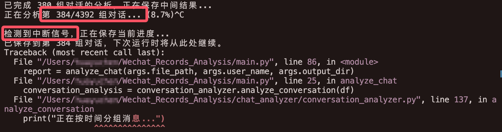
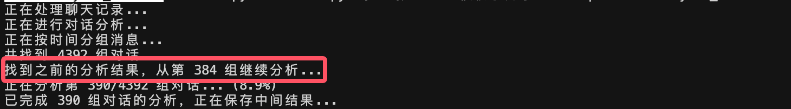

> your Wechat Record Extract and Analyse Bot, providing DECISIVE EVIDENCE when you need PROOF in a QUARREL!

# 微信聊天记录分析工具

这是一个用于分析微信聊天记录的工具，可以生成词云图并进行简单的数据分析。

## 使用说明

1. 准备聊天记录文件：
   - 将微信聊天记录导出为txt文件
   - 确保文件编码为UTF-8

2. 运行程序：
   ```bash
   python main.py "聊天记录文件.txt" "你的用户名" --output-dir analysis_results
   ```

## 运行时特性：
   - 显示实时进度
   - 支持随时中断（Ctrl+C）
   - 自动保存分析结果
   - 智能恢复分析进度

例：



## 错误处理机制

1. API 调用错误
   - 自动重试机制
   - 详细的错误日志
   - 优雅的失败处理
   - 状态恢复能力

2. 数据处理错误
   - JSON 格式自动修复
   - 时间戳格式转换
   - 缺失数据处理
   - 类型自动转换

3. 文件操作错误
   - 自动创建目录
   - 文件权限检查
   - 数据完整性验证
   - 增量保存机制

## 输出说明

1. 中间结果
   - 位置：`analysis_results/intermediate_results.json`
   - 格式：JSON
   - 更新频率：每10组对话
   - 自动时间戳转换

2. 最终分析报告
   - 对话统计数据
   - 情感分析结果
   - 互动模式图表
   - 完整性验证

## 注意事项

1. 数据安全
   - 所有分析在本地进行
   - 仅必要数据发送至 API
   - 支持数据脱敏
   - 敏感信息过滤

2. 性能考虑
   - 大文件分批处理
   - 内存使用优化
   - 支持长时间运行
   - 断点续传支持

3. 使用限制
   - API 调用频率限制
   - 文件大小建议：<100MB
   - 支持的文件格式：txt
   - 内容合规要求

## 故障排除

1. 常见问题
   - API 超时：检查网络连接
   - JSON 解析错误：程序会自动修复
   - 内存不足：尝试减小批处理大小
   - 内容被拒：检查敏感词过滤

2. 错误代码说明
   - E001：API 调用失败
   - E002：JSON 解析错误
   - E003：文件操作错误
   - E004：内容合规性错误

## 开发计划

1. 近期更新
   - 多线程支持
   - 更多可视化选项
   - 导出格式优化
   - 更多 API 支持

2. 待实现功能
   - 自定义分析规则
   - 批量文件处理
   - 更多 API 支持
   - 高级数据分析

## 许可证

MIT License

## 联系方式

如有问题或建议，请提交 Issue。